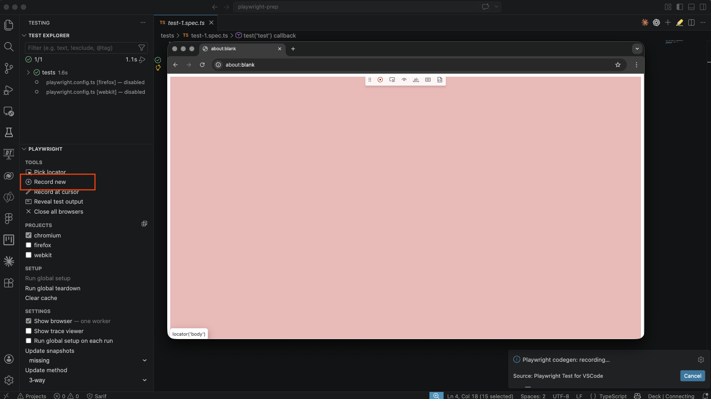
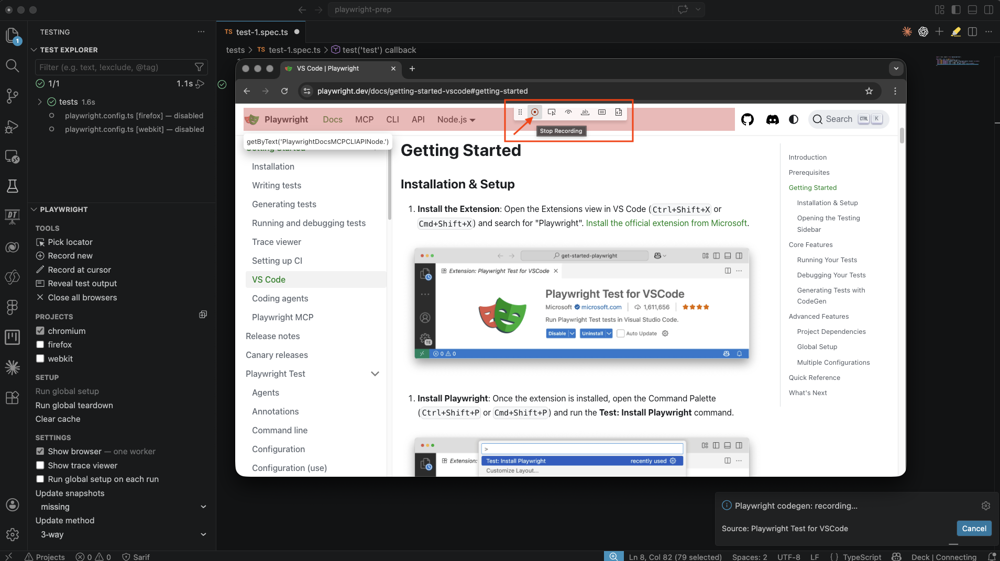
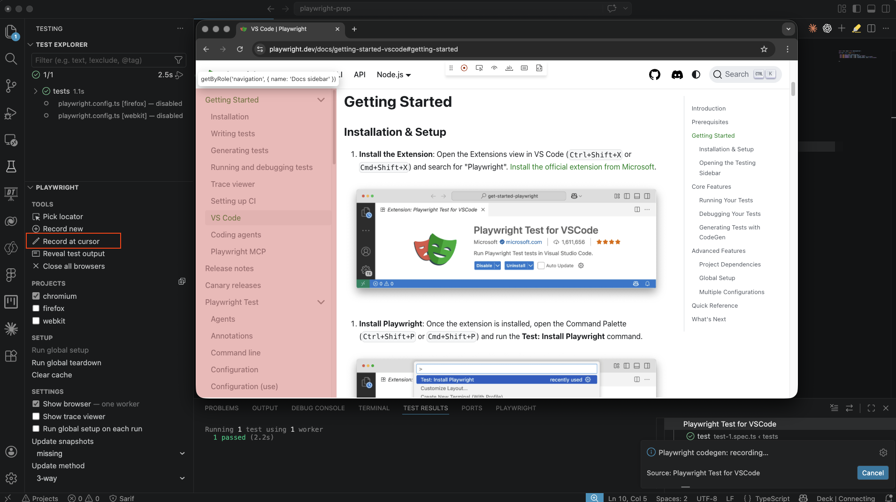

# Lesson 1 - Manage tests

## Objective


## Step 1 - Record a new test

There are several ways to create a test in Playwright. You can write a test manually in TypeScript or JavaScript, or you can use the recorder, better known as `codegen`, to create a test.

In this step, we will use the `codegen` functionality to generate a new test.

We will create a test that opens the Playwright website, navigates to the VS Code section, and then goes to Getting Started.

Open VS Code.

Open the Playwright extension.

Click `Record new`.



A blank browser window will now open in `record` mode.

Go to the `playwright.dev` website.

Click `Docs`.

Under `Getting Started`, click `VS Code`.

In the menu on the right-hand side, click `Getting Started`.


Stop the recording in the Playwright menu visible in the browser.




As a result of this new recording, a new test file named `test-1.spec.ts` has been generated.

As you can see in this file, your recording has been converted into a TypeScript test, with each action included as a separate line in the script.


## Step 2 - Run your new test

In the previous lesson, you learned how to run a test. This can be done in several ways.

Run the test you just created in UI mode.

Open your terminal and run the following command:

```bash
npx playwright test --ui
```

Go to the test you just created and click `run`.


## Step 3 - Make changes to your test

After a test has been created, you may want to change it or extend it. This can also be done in different ways. You can make changes directly in the `spec.ts` file by writing TypeScript, but you can also use the `codegen` functionality to make changes.

In this step, we will further extend the test from Step 2. Follow these steps:

Open the newly generated test named `test-1.spec.ts` in your editor.

Click the `play` icon to run the test


When the test has finished, keep the browser open

Go to the Playwright extension and click `Record at cursor`



All steps you take now will be added to the test in `test-1.spec.ts`

In this example, we click `CLI` at the top of the page so that this navigation is added to the test.

Stop the recording


As you can see, the test script has now been extended with a new step


## Step 4 - Aria snapshot


## Step 5 - View HTML report


## Summary

You now have:

## Reference Links

- [link](website)

