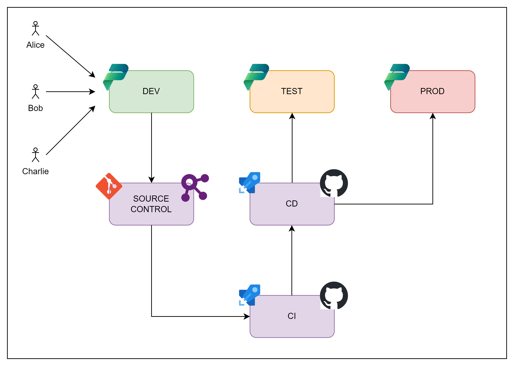

# Power Platform DevOps Bootcamp

Welcome to the Power Platform DevOps Bootcamp hosted by [Power Community](https://www.powercommunity.com/). In this repository you will find all the learning materials, and instructions necessary for the bootcamp.

## Your Instructors

The bootcamp is led by [Wael Hamze](https://www.linkedin.com/in/waelhamze/), [Parvez Ghumra](https://www.linkedin.com/in/parvezghumra), [Arjan Rijsdijk](https://www.linkedin.com/in/arjanrijsdijk/) and [Stalin Ponnusamy](https://www.linkedin.com/in/stalinponnusamy/). It is intended to be an interactive learning experience, so feel free to ask questions and engage during the day. We hope you find it helpful and that it gives you a good starting point for learning Power Platform DevOps principles. If you have any follow-up questions after the bootcamp, don't hesitate to reach out to us on LinkedIn.

## Agenda

| Start | End | Description |
| --- | --- | --- |
| 9:00 | 9:30 | Intro (Speakers + Audience) |
| 09:30 | 10:15 | Overview of DevOps |
| 10:15 | 11:00 | Pre-requisites + Lab Intros |
| 11:00 | 11:15 | Break |
| 11:15 | 13:00 | Labs |
| 13:00 | 14:00 | Lunch |
| 14:00 | 14:45 | Testing Session |
| 14:45 | 16:30 | Labs (Including testing) |
| 16:30 | 17:00 | Q&A + Wrap Up |

## Minimum Requirements

In order to get the most value out of the bootcamp, we recommend that you have the following as a minimum. This is a checklist for completeness but you should have these covered already if you have completed the pre-workshop setup steps as documented [here](./Media/PP-ALM-Bootcamp-Setup-Guide.docx):
1. Basic experience of customising Power Platform including Dataverse, Model Driven Apps and Power Automate using the [Power Apps Maker Portal](https://make.powerapps.com)  
2. A laptop with power supply and any necessary accessories with:  
    a. [Visual Studio Code](https://code.visualstudio.com/download)  
    b. [Git](https://git-scm.com/install/windows)  
    c. [Power Platform CLI](https://aka.ms/pac)  
    d. [PowerShell](https://learn.microsoft.com/en-us/powershell/scripting/install/install-powershell?view=powershell-7.6)  
3. Three [Power Platform Developer environments](https://learn.microsoft.com/en-us/power-platform/developer/plan) with Dataverse enabled and [admin level access in these environments](https://admin.powerplatform.microsoft.com). Trial environments are not recommended although they may suffice if there's no alternative option  
4. [An Azure App Registration with Client ID and Secret registered as an S2S App](https://learn.microsoft.com/en-us/power-apps/developer/data-platform/walkthrough-register-app-azure-active-directory#confidential-client-app-registration) in each of 3 environments with the System Administrator Security Role (although we will be walking through the setup of this in the introductory labs) 
5. An [Azure DevOps organization](https://dev.azure.com/) with either:  
    a. Full organization admin rights; OR  
    b. A [project](https://learn.microsoft.com/en-us/azure/devops/organizations/projects/create-project?view=azure-devops&tabs=browser) with admin rights in it and the Power Platform Build Tools extension for Azure DevOps pre-installed  
6. A working [Microsoft-hosted agent](https://aka.ms/azpipelines-parallelism-request) and/or a self-hosted agent configured in Azure DevOps to process pipelines  
7. Curiosity for learning DevOps for Power Platform

If you have been unable to complete any of these prerequisites, please complete [this form](https://forms.cloud.microsoft/e/E9K8z9b78g), and we will try our best to help

## Background

You are a DevOps Engineer at Zava Construction supporting a Power Platform implementation project where a team of 3 low-code/no-code developers are building a solution for internal use. They share the same development environment and require quality assurance to be conducted in a dedicated test environment before the solution is allowed to be deployed to production

## The Challenge

Implement a source control centric development, build and deployment process using the capabilities available within Azure DevOps. The labs in this repository will guide you through the setup and by the end of the bootcamp, you will have a fully a operational setup.

## Further Resources

Here are some helpful resources that will enhance your learning experience during and beyond the bootcamp. Be sure to bookmark these for future reference and to explore at your lesiure!  
1. [Power Platform ALM Documentation](https://learn.microsoft.com/en-us/power-platform/alm/)
2. [Power Platform Build Tools GitHub repository with task definitions](https://github.com/microsoft/powerplatform-build-tools/tree/main/src/tasks)  
3. [Power Platfrom Build Tools Tasks documentation](https://learn.microsoft.com/en-us/power-platform/alm/devops-build-tool-tasks)  
4. [Power Platform CLI Reference](https://learn.microsoft.com/en-us/power-platform/developer/cli/reference/)  
5. [Microsoft.PowerApps.Administration.PowerShell Module](https://learn.microsoft.com/en-us/powershell/module/microsoft.powerapps.administration.powershell/?view=pa-ps-latest)  
6. [Microsoft.PowerApps.Checker.PowerShell Module](https://learn.microsoft.com/en-us/powershell/module/microsoft.powerapps.checker.powershell/?view=pa-ps-latest)  
7. [Microsoft.PowerPlatform.EnterprisePolicies Module](https://learn.microsoft.com/en-us/powershell/module/microsoft.powerplatform.enterprisepolicies/?view=pa-ps-latest)  
8. [Microsoft.Xrm.OnlineManagementAPI Module](https://learn.microsoft.com/en-us/powershell/module/microsoft.xrm.onlinemanagementapi/?view=pa-ps-latest)  
9. [Microsoft.Xrm.Tooling.PackageDeployment Module](https://learn.microsoft.com/en-us/powershell/module/microsoft.xrm.tooling.packagedeployment/?view=pa-ps-latest)
10. [Microsoft Power Platform API reference](https://learn.microsoft.com/en-us/rest/api/power-platform/)